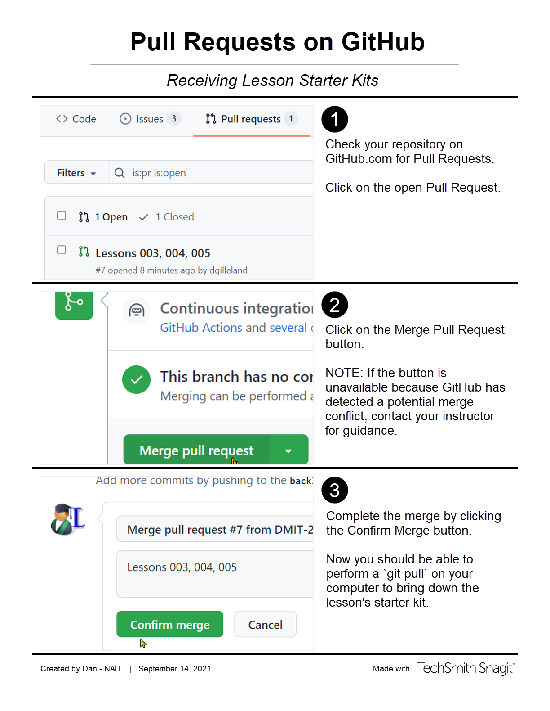

# Class Notes

> Here is where I will enter general notes from my classes, including check-lists for my **practice homework** as well as **questions** I have for each upcoming class.

## Week 1 | Day 1

TBD...

## Week 2 | Day 1

I can include an image in my markdown by using the following syntax pattern.

```markdown

```



