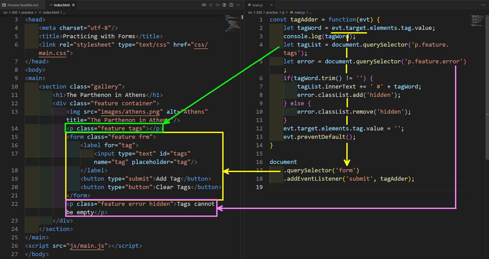

# DOM Objects

> Mentally Mapping Object Types

A big part of understanding the code is recognizing what parts of the code are representing what parts of the Document Object Model (so you know which elements you are working with from the DOM) and what parts are the other things associated with our program (like local variables, etc.).

Sometimes, just printing out some of the previous code examples will help. You can put the HTML and JavaScript stuff side-by-side and see what the JavaScript code is relating to.

In the image above, `tagWord`, `tagList` and `error` are all names for variables that I (as a programmer) have come up with. The data type of each of those is determined by the value held by that variable.

`tagAdder` is a name I (again, as a programmer) decided to use for the function that I declared (lines 1-14).

The data type of a variable will determine what I can "do" with it. So, for the example of the `tagList` variable, it's value is the `
...
` element. That is, tagList is an HTMLElement object (specifically, a [paragraph element](https://developer.mozilla.org/en-US/docs/Web/HTML/Element/p), or [HTMLParagraphElement](https://developer.mozilla.org/en-US/docs/Web/API/HTMLParagraphElement))